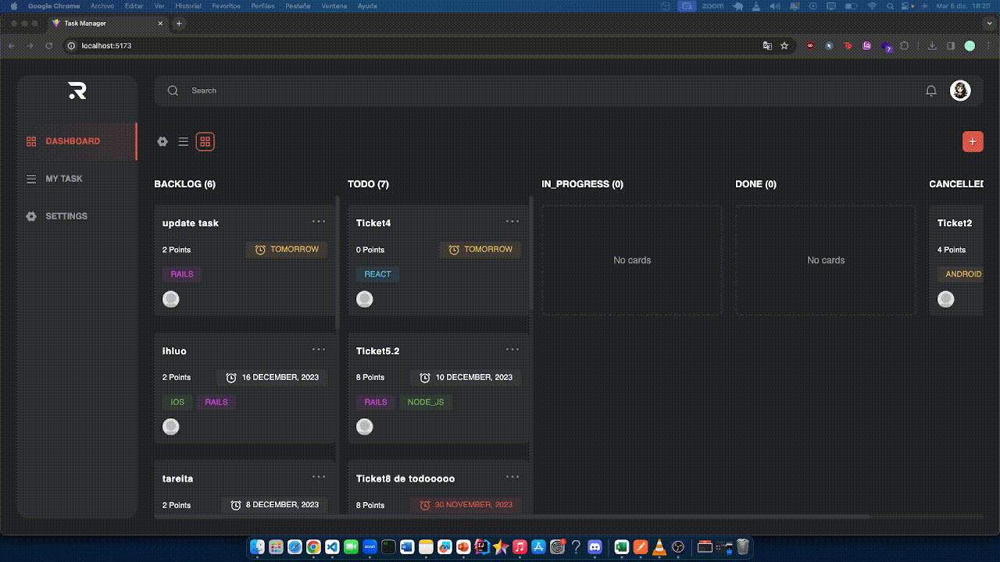

# Task Manager

## Table of Contents

- [Introduction](#introduction)
- [Features](#features)
- [Installation](#installation)
- [Usage](#usage)
- [Demo](#demo)

## Introduction

This app, made with Vite, helps you easily add, delete, edit, and update your tasks.

## Features

- **Browse Tasks:** Explore tasks conveniently organized by status.
- **Add New Tasks:** Seamlessly create and assign tasks to users.
- **Update Tasks:** Modify task details, including due dates, names, and more.
- **Delete Tasks:** Remove tasks with ease.

## Installation

Follow these steps to set up **TaskMaster** on your local machine.

# Clone the repository
git clone https://github.com/anagotoyas/task-manager.git

# Install dependencies
npm install

 ## Usage

 npm run dev

 ## Demo

 

